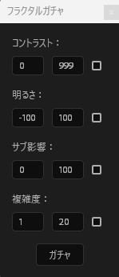

# フラクタルガチャ

After Effects のフラクタルノイズを、ランダム生成で何度でも引き直せる ScriptUI パネルです。
「いい感じのノイズ」を出すためにパラメータを手で詰める作業を、ボタン一つに置き換えます。


## できること

- ボタン一つでフラクタルノイズのパラメータをランダム生成
- 気に入った結果をそのまま選択中のレイヤーに適用
- 生成範囲を指定して、狙った方向性の中でランダム化
- 【ここに実際の機能を追記／不要な行は削除】

## 動作環境

| 項目 | 内容 |
| --- | --- |
| After Effects | CC 2025 / 2026 |
| OS | Windows 11（macOS は未検証） |

## インストール

1. `フラクタルガチャ.jsx` をダウンロードします。
2. 下記のフォルダに配置します。
   - Windows: `C:\Program Files\Adobe\Adobe After Effects <version>\Support Files\Scripts\ScriptUI Panels`
   - macOS: `/Applications/Adobe After Effects <version>/Scripts/ScriptUI Panels`
3. After Effects を再起動します。
4. `ウィンドウ` メニューの一覧に `フラクタルガチャ.jsx` が追加されます。

> 初回は `編集 > 環境設定 > スクリプトとエクスプレッション` で
> 「スクリプトによるファイルへの書き込みとネットワークへのアクセスを許可」に
> チェックが入っている必要があります。

## 使い方



1. フラクタルノイズを適用したいレイヤーを選択します。
2. 「ガチャを回す」ボタンを押します。
3. 結果が気に入らなければ、そのまま押し直します。
4. sssss
## 実装のポイント

### Undo グループを try/finally で保護

`app.beginUndoGroup()` と `endUndoGroup()` を `try...finally` で挟み、
処理の途中で例外が発生しても Undo スタックが開いたままにならないようにしています。
ここが崩れると After Effects 側の取り消し履歴ごと壊れるため、
例外の有無にかかわらず必ず閉じる構成を優先しました。

```javascript
app.beginUndoGroup("フラクタルガチャ");
try {
  applyRandomParameters(layer);
} finally {
  app.endUndoGroup();
}
```

### 入力値の検証を一箇所に集約

各パラメータの上下限チェックを `limitInputValue` にまとめ、
プロパティへ値を渡す前に必ず通しています。
バリデーションを呼び出し側に散らすと、パラメータを追加するたびに
チェック漏れが起きるため、追加時に一箇所だけ見れば済む形にしました。

### IIFE によるスコープ分離

スクリプト全体を即時実行関数で包み、変数をグローバルに出していません。
ExtendScript は複数のスクリプトが同一のグローバル空間を共有するため、
他のスクリプトと変数名が衝突すると原因の分かりにくい不具合になります。

### ScriptUI パネルの構造

【グループの組み方、レイアウトで工夫した点、詰まって解決した点を2〜3行で】

### 環境について

ExtendScript は ECMAScript 3 相当の実行環境で、`let` / `const` やアロー関数、
`Array.prototype.forEach` などが使えません。
モダンな構文に頼らず、素の JavaScript の範囲で読みやすさを保つことを意識しました。

---

## 今後の課題

- 【既知の不具合、未実装のまま残していること】
- 【今の実装で気になっている点】

## 配布先

BOOTH で配布しています: https://tapioka-1145.booth.pm/items/8585413

## ライセンス

MIT License
